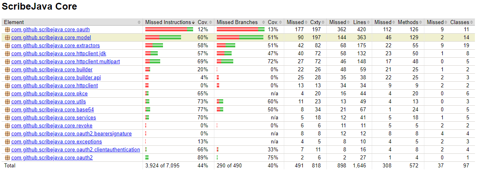

# Report for Assignment 1

## Project chosen
Name: cribeJava
URL: https://github.com/scribejava/scribejava
Number of lines of code and tool used to count it: 17332, lizard
Programming language: Java

## Coverage measurement
### Existing tool
Name of the existing tool used was Jacoco. It was executed by adding a Jacoco plugin into the pom.xml file and then executing maven. (Add some details)
(Provide screenshot, there is a problem that it only creates reports for specific parts such as scribejava-core, figure out a way to put it all in one report)

### Our own coverage tool
