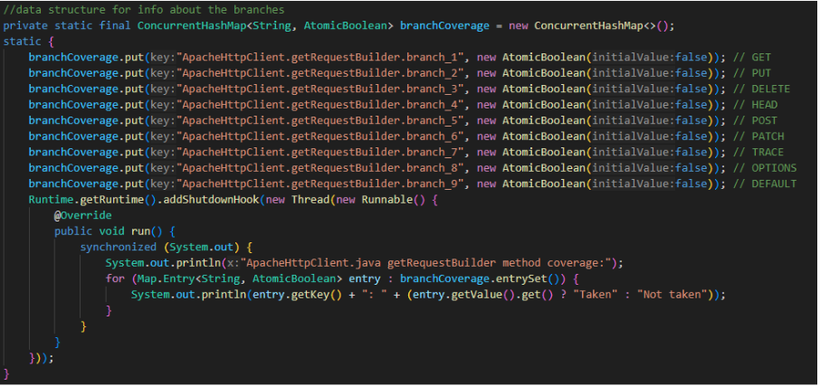
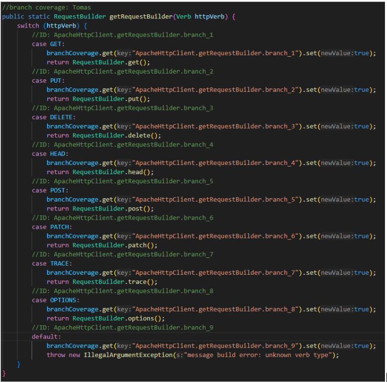
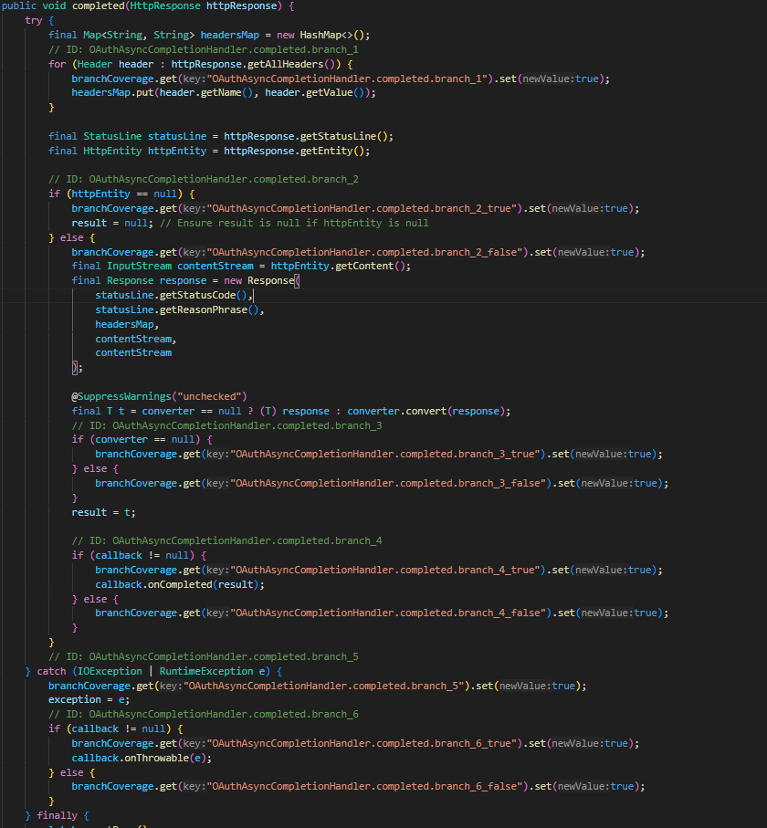
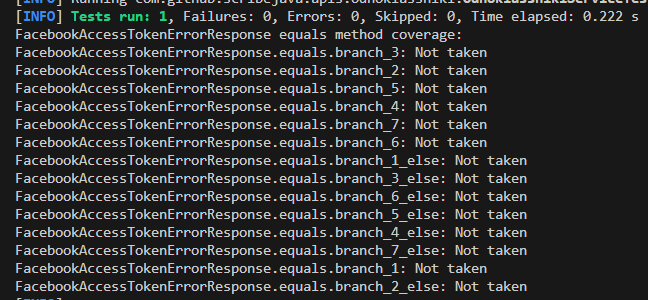
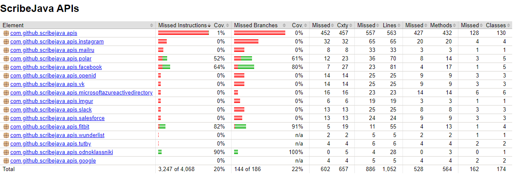

# Report for Assignment 1

## Project chosen
Name: ScribeJava
URL: https://github.com/scribejava/scribejava
Number of lines of code and tool used to count it: 17332, lizard
Programming language: Java

## Coverage measurement

### Existing tool
Name of the existing tool used was Jacoco. It was executed by adding a Jacoco plugin into the pom.xml file and then executing command: "mvn clean jacoco:prepare-agent install jacoco:report"

#### Coverage results provided by the existing tool:

### Our own coverage tool
#### Tomas Busa
##### 3.3
###### Function 1: com.github.scribejava.httpclient.apache.ApacheHttpClient.getRequestBuilder
###### Data Structure to hold coverage information, write all information about the branches taken to a console:

###### Set a flag if the branch is reached:

###### Coverage results output:

###### Function 2: com.github.scribejava.httpclient.apache.OAuthAsyncCompletionHandler.completed
###### Data Structure to hold coverage information, write all information about the branches taken to a console:

###### Set a flag if the branch is reached:

###### Coverage results output:

##### 3.4
###### Function 1: com.github.scribejava.httpclient.apache.ApacheHttpClient.getRequestBuilder
###### New tests:

###### Coverage before:

###### Coverage after:

###### Function 2: com.github.scribejava.httpclient.apache.OAuthAsyncCompletionHandler.completed
###### New tests:

###### Coverage before:

###### Coverage after:

--------------------------------------------------------------------------------------------------------------------------------------------------------------------------------------------------------------------
#### Jayran Duggins
##### 3.3
###### Function 1: scribejava-httpclient-armeria/src/main/java/com/github/scribejava/httpclient/armeria/ArmeriaHttpClient.java (getHttpMethod)
###### Data Structure to hold coverage information, write all information about the branches taken to a console:

###### Set a flag if the branch is reached:

###### Coverage results output:

###### Function 2: scribejava-httpclient-armeria/src/main/java/com/github/scribejava/httpclient/armeria/ArmeriaHttpClient.java (getServicePath)
###### Data Structure to hold coverage information, write all information about the branches taken to a console:

###### Set a flag if the branch is reached:

###### Coverage results output:

###### Code Used to Print Coverage (Function 1 & 2):

##### 3.4
###### Function 1: scribejava-httpclient-armeria/src/main/java/com/github/scribejava/httpclient/armeria/ArmeriaHttpClient.java (getHttpMethod)
###### New tests:

###### Coverage before:

###### Coverage after (See Highlighted Function):

###### Function 2: scribejava-httpclient-armeria/src/main/java/com/github/scribejava/httpclient/armeria/ArmeriaHttpClient.java (getServicePath)
###### New tests:

###### Coverage before:

###### Coverage after:

--------------------------------------------------------------------------------------------------------------------------------------------------------------------------------------------------------------------

#### Nikola Bakalinov
##### 3.3
###### Function 1: scribejava-apis/src/main/java/com/github/scribejava/apis/facebook/FacebookAccessTokenErrorResponse.equals
###### Data Structure to hold coverage information, write all information about the branches taken to a console:

###### Set a flag if the branch is reached:

###### Coverage results output:

###### Function 2: scribejava-httpclient-ning/src/main/java/com/github/scribejava/httpclient/ning/NingHttpClient.doExecuteAsync
#### Data Structure to hold coverage information, write all information about the branches taken to a console:

###### Set a flag if the branch is reached:

###### Coverage results output:

##### 3.4
###### Function 1: scribejava-apis/src/main/java/com/github/scribejava/apis/facebook/FacebookAccessTokenErrorResponse.equals
###### New Tests 

###### Coverage before:

###### Coverage after:

###### Function 2: scribejava-httpclient-ning/src/main/java/com/github/scribejava/httpclient/ning/NingHttpClient.doExecuteAsync
###### New Tests 

###### Coverage before : 

###### Coverage after:

--------------------------------------------------------------------------------------------------------------------------------------------------------------------------------------------------------------------

#### Luis Sartorius
##### 3.3
###### Function 1: Equals for FitBit

###### Function 2: Equals for Polar

##### Console logs for branch hits taken.

##### 3.4
###### Test 1 Equals for Polar
Created a test file
###### Auth2Polar
[Test file][https://github.com/YBushi/SEP-Assingment1/commits/Luis-report/scribejava-apis/src/test/java/com/github/scribejava/apis/polar/PolarOAuth2AccessTokenTest.java]
###### Before:

###### After:

###### Results:
The coverage went to 0 to 100% because no test was created for it.

###### Test 2 Equals for FitBit

###### Auth2FitBit
[Test file][https://github.com/YBushi/SEP-Assingment1/commits/Luis-report/scribejava-apis/src/test/java/com/github/scribejava/apis/fitbit/FitBitOAuth2AccessTokenTest.java]
###### Before:

###### After:

###### Results:
The coverage went to 0 to 100% because no test was created for it.

### Overall
Old coverage results:

New coverage results: 

## Statement of individual contributions
Tomas: I have added the jacoco plugin into the pom.xml file and executed the previously mentioned command to generate coverage reports. I have created my own coverage tool for two functions which showed me which branches weren't covered by the existing tests. I have created new test cases which improved the branch coverage for those functions. Lastly, I have created the new coverage reports after we merged all of our development branches that contained new test cases, which improved our overall branch coverage.

Nikola: I have used the jacoco command from the plugin to generate coverage reports and check the files where I chose the functions to instrument. I informed my teammates on the functions and files I chose so that we don't pick the same by coincidence. Then I instrumented both functions with my own coverage tool, then I got to see which branches were covered and which weren't by the existing tests. So right after that I went on to create new tests to cover the branches which weren't covered. With this approach I managed to get the branch coverage in both functions to be above 80%. While I was working on my branch "nikola-development" I was comitting frequentely. Lastly, when all my work was finished I created a pull request that was reviewed by my teammates and was then merged into the master branch. During this process I also communicated a lot with my teammates regarding the work, I made sure they were on track and helped them if they needed any help. The communication was mostly done through a Whatsapp group.

Luis: I used jacoco to help me track the functions that were not tested/low branch coverage and found that the equals function for sume auth20 were not tested. Therefore I wrote tests for both the Polar and FitBit API. I managed to get a 100% hit on the branch that I covered. I also quickly reviewed some of my teammates coverage tests and results.

Jayran: I ran the existing tests on the project, and using the jacoco plugin, I looked at which functions have low branch coverages. I went through a couple to see which ones I understand at first glance. After this, I made my own coverage tool for the two functions that I chose, which showed me which branches were not being covered (taken or not taken). The results went along side with the branches not being covered in the jacoco coverage report, which told me that my coverage instrument was correct. After this, I made my own custom test file, which would activiate some of the branches not being reached. This was quite simple since I attemped to understand the logic of the functions that I chose. I then ran my new test along with the existing tests, and assessed the branch coverage once again using the jacoco tool. I also comapred the results of that coverage report to my coverage instrument, and once again the results were the same (where certain branches were taken and some were not). Once my work was complete, I took screenshots and pushed my code to my branch on the repository, where, I then made a pull request for it to be merged to the main branch.
