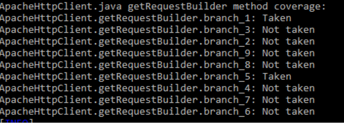

# Report for Assignment 1

## Project chosen
Name: cribeJava
URL: https://github.com/scribejava/scribejava
Number of lines of code and tool used to count it: 17332, lizard
Programming language: Java

## Coverage measurement
### Existing tool
Name of the existing tool used was Jacoco. It was executed by adding a Jacoco plugin into the pom.xml file and then executing maven. (Add some details)
(Provide screenshot, there is a problem that it only creates reports for specific parts such as scribejava-core, figure out a way to put it all in one report)

### Our own coverage tool
---------------------------------------------------------------------------------------------------------------------------------------------------------------------------------------------------------------------
#### Tomas Busa
#### 3.3
#### Function 1: com.github.scribejava.httpclient.apache.ApacheHttpClient.getRequestBuilder
#### Data Structure to hold coverage information, write all information about the branches taken to a console:

#### Set a flag if the branch is reached:

#### Coverage results output:

####
#### Function 2: com.github.scribejava.httpclient.apache.OAuthAsyncCompletionHandler.completed
#### Data Structure to hold coverage information, write all information about the branches taken to a console:

#### Set a flag if the branch is reached:

#### Coverage results output:

####
#### 3.4
#### Function 1: com.github.scribejava.httpclient.apache.ApacheHttpClient.getRequestBuilder
#### New tests:

#### Coverage before:

#### Coverage after:

####
#### Function 2: com.github.scribejava.httpclient.apache.OAuthAsyncCompletionHandler.completed
#### New tests:

#### Coverage before:

#### Coverage after:

---------------------------------------------------------------------------------------------------------------------------------------------------------------------------------------------------------------------
-
#### Jayran Duggins
#### 3.3
#### Function 1: scribejava-httpclient-armeria/src/main/java/com/github/scribejava/httpclient/armeria/ArmeriaHttpClient.java (getHttpMethod)
#### Data Structure to hold coverage information, write all information about the branches taken to a console:

#### Set a flag if the branch is reached:

#### Coverage results output:

####
#### Function 2: scribejava-httpclient-armeria/src/main/java/com/github/scribejava/httpclient/armeria/ArmeriaHttpClient.java (getServicePath)
#### Data Structure to hold coverage information, write all information about the branches taken to a console:

#### Set a flag if the branch is reached:

#### Coverage results output:

#### Code Used to Print Coverage (Function 1 & 2):

####
#### 3.4
#### Function 1: scribejava-httpclient-armeria/src/main/java/com/github/scribejava/httpclient/armeria/ArmeriaHttpClient.java (getHttpMethod)
#### New tests:

#### Coverage before:

#### Coverage after:

####
#### Function 2: scribejava-httpclient-armeria/src/main/java/com/github/scribejava/httpclient/armeria/ArmeriaHttpClient.java (getServicePath)
#### New tests:

#### Coverage before:

#### Coverage after:

---------------------------------------------------------------------------------------------------------------------------------------------------------------------------------------------------------------------

Nikola Bakalinov
Function 1: scribejava/scribejava-httpclient-ning/src/main/java/com/github/scribejava/httpclient/ning
/NingHttpClient.java  (doExecuteAsync)

Function 2: SEP-Assingment1/scribejava-httpclient-armeria/src/main/java/com/github/scribejava/httpclient/armeria
/ArmeriaHttpClient.java  (doExecuteAsync)

Armeria coverage before :

3.3
Function 1: scribejava-apis/src/main/java/com/github/scribejava/apis/facebook/FacebookAccessTokenErrorResponse.equals
Data Structure to hold coverage information, write all information about the branches taken to a console:

Set a flag if the branch is reached:

Coverage results output:

---------------------------------------------------------------------------------------------------------------------------------------------------------------------------------------------------------------------

