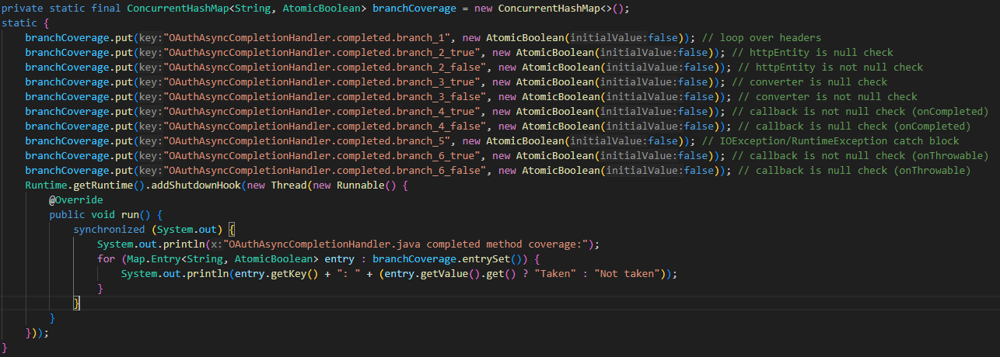
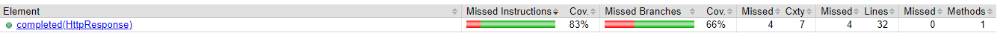
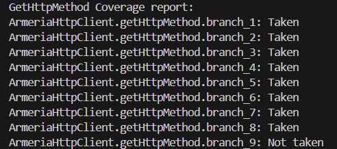
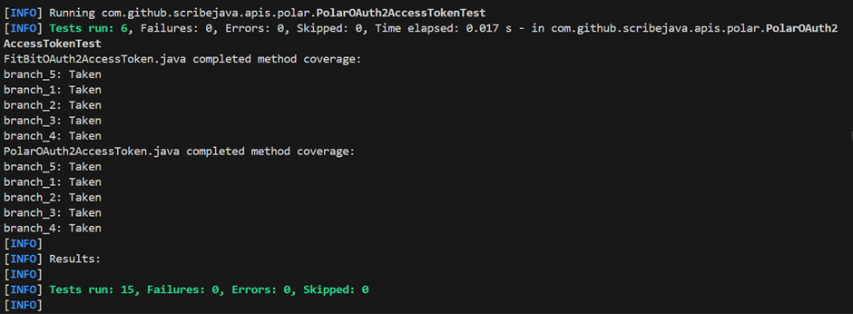

# Report for Assignment 1

## Project chosen
Name: ScribeJava
URL: https://github.com/scribejava/scribejava
Number of lines of code and tool used to count it: 17332, lizard
Programming language: Java

## Coverage measurement
### Existing tool
Name of the existing tool used was Jacoco. It was executed by adding a Jacoco plugin into the pom.xml file and then executing command: "mvn clean jacoco:prepare-agent install jacoco:report"

Coverage results provided by the existing tool:

### Our own coverage tool
#### Tomas Busa
#### 3.3
#### Function 1: com.github.scribejava.httpclient.apache.ApacheHttpClient.getRequestBuilder
#### Data Structure to hold coverage information, write all information about the branches taken to a console:

#### Set a flag if the branch is reached:

#### Coverage results output:

####
#### Function 2: com.github.scribejava.httpclient.apache.OAuthAsyncCompletionHandler.completed
#### Data Structure to hold coverage information, write all information about the branches taken to a console:

#### Set a flag if the branch is reached:

#### Coverage results output:

####
#### 3.4
#### Function 1: com.github.scribejava.httpclient.apache.ApacheHttpClient.getRequestBuilder
#### New tests:

#### Coverage before:

#### Coverage after:

####
#### Function 2: com.github.scribejava.httpclient.apache.OAuthAsyncCompletionHandler.completed
#### New tests:

#### Coverage before:

#### Coverage after:

---------------------------------------------------------------------------------------------------------------------------------------------------------------------------------------------------------------------
-
#### Jayran Duggins
#### 3.3
#### Function 1: scribejava-httpclient-armeria/src/main/java/com/github/scribejava/httpclient/armeria/ArmeriaHttpClient.java (getHttpMethod)
#### Data Structure to hold coverage information, write all information about the branches taken to a console:

#### Set a flag if the branch is reached:

#### Coverage results output:

####
#### Function 2: scribejava-httpclient-armeria/src/main/java/com/github/scribejava/httpclient/armeria/ArmeriaHttpClient.java (getServicePath)
#### Data Structure to hold coverage information, write all information about the branches taken to a console:

#### Set a flag if the branch is reached:

#### Coverage results output:

#### Code Used to Print Coverage (Function 1 & 2):

####
#### 3.4
#### Function 1: scribejava-httpclient-armeria/src/main/java/com/github/scribejava/httpclient/armeria/ArmeriaHttpClient.java (getHttpMethod)
#### New tests:

#### Coverage before:

#### Coverage after:

####
#### Function 2: scribejava-httpclient-armeria/src/main/java/com/github/scribejava/httpclient/armeria/ArmeriaHttpClient.java (getServicePath)
#### New tests:

#### Coverage before:

#### Coverage after:

---------------------------------------------------------------------------------------------------------------------------------------------------------------------------------------------------------------------

Nikola Bakalinov

3.3
Function 1: scribejava-apis/src/main/java/com/github/scribejava/apis/facebook/FacebookAccessTokenErrorResponse.equals

Data Structure to hold coverage information, write all information about the branches taken to a console:

Set a flag if the branch is reached:

Coverage results output:

Function 2: scribejava-httpclient-ning/src/main/java/com/github/scribejava/httpclient/ning/NingHttpClient.doExecuteAsync

Data Structure to hold coverage information, write all information about the branches taken to a console:

Set a flag if the branch is reached:

Coverage results output:

3.4

New Tests 

Function 1: scribejava-apis/src/main/java/com/github/scribejava/apis/facebook/FacebookAccessTokenErrorResponse.equals

Coverage before:

Coverage after:

New Tests 

Function 2: scribejava-httpclient-ning/src/main/java/com/github/scribejava/httpclient/ning/NingHttpClient.doExecuteAsync

Coverage before : 

Coverage after:

## Luis Sartorius
# **Function 1: appendSignature**

# **Function 2: Equals**
#### Polar

#### FitBit

### Individual tests

#### Console logs for branch hits taken.

## Test 1 for appendSignature
Created a test file
[Test file][https://github.com/YBushi/SEP-Assingment1/commits/Luis-report/scribejava-core/src/test/java/com/github/scribejava/core/oauth/OAuth10aServiceTest.java]
#### Before:

#### After:

#### Results:
The coverage went to 0 to 100% because no test was created for it.

## Test 2 for Equals
Created a test file
### Auth2Polar
[Test file][https://github.com/YBushi/SEP-Assingment1/commits/Luis-report/scribejava-apis/src/test/java/com/github/scribejava/apis/polar/PolarOAuth2AccessTokenTest.java]
#### Before:

#### After:

### Auth2FitBit
[Test file][https://github.com/YBushi/SEP-Assingment1/commits/Luis-report/scribejava-apis/src/test/java/com/github/scribejava/apis/fitbit/FitBitOAuth2AccessTokenTest.java]
#### Before:

#### After:

#### Results:
The coverage went to 0 to 100% because no tests was created for both.

### Overall
Old coverage results:

New coverage results: 

## Statement of individual contributions
Tomas: I have added the jacoco plugin into the pom.xml file and executed the previously mentioned command to generate coverage reports. I have created my own coverage tool for two functions which showed me which branches weren't covered by the existing tests. I have created new test cases which improved the branch coverage for those functions. Lastly, I have created the new coverage reports after we merged all of our development branches that contained new test cases, which improved our overall branch coverage.
